# AeroEye AI 🦅 - Aerial Object Classification & Detection

AeroEye AI is an end-to-end Computer Vision system designed to solve security surveillance, wildlife protection, and restricted airspace monitoring challenges by accurately classifying and detecting aerial objects—specifically **Birds** and **Drones**.

The project implements two pipelines:
1. **Binary Classification**: Differentiates between birds and drones using a Custom CNN model and a Transfer Learning model (MobileNetV2).
2. **Object Detection**: Identifies, localizes, and labels birds and drones in real-time using a fine-tuned YOLOv8 Nano model.

A web application built using **Streamlit** provides an interactive, dark-themed dashboard to upload aerial images, view predictions, inspect model latency, and visualize bounding boxes.

---

## 🎯 Key Features
* **Dual-Inference Pipeline**: Support for high-speed binary classification (Bird vs Drone) and real-time YOLOv8 object detection.
* **CPU-Optimized Architectures**:
  - A lightweight **Custom CNN** with Global Average Pooling (GAP) designed for fast convergence and a small storage footprint on CPU.
  - A **Transfer Learning** pipeline leveraging pre-trained **MobileNetV2** features for robust classification.
  - A custom-trained **YOLOv8 Nano** object detector for real-time bounding box localization.
* **Premium Dashboard UI**: Built with Streamlit, incorporating modern glassmorphism design tokens, metrics panels, custom HTML/CSS badges, and dynamic pipeline flowcharts.
* **Training Diagnostics**: Built-in tabs to view and compare confusion matrices, classification reports, loss curves, and training history for all models.

---

## 📊 Dataset Specifications

### 1. Classification Dataset (Binary: Bird / Drone)
* **Training Set**: 2,662 images (1,414 Bird, 1,248 Drone)
* **Validation Set**: 442 images (217 Bird, 225 Drone)
* **Test Set**: 215 images (121 Bird, 94 Drone)

### 2. Object Detection Dataset (YOLOv8 Format)
* **Total Images**: 3,319 images with corresponding bounding box labels in `.txt` format:
  `<class_id> <x_center> <y_center> <width> <height>` (normalized).
* **Splits**: Train (2,662), Validation (442), Test (215)

---

## 🛠️ Project Structure
```bash
├── app.py                      # Main Streamlit web application
├── download_models.py          # Script to check and verify model availability
├── run_all.py                  # Orchestrator to run preprocessing, training, and evaluation
├── requirements.txt            # Project python dependencies
├── dataset/                    # Classification dataset
├── dataset/yolo_format/   # YOLOv8 format object detection dataset
├── notebooks/                  # Interactive Jupyter Notebooks
│   ├── Aerial_Object_Classification_using_Deep_Learning.ipynb
│   └── Aerial_Object_Detection_Dataset_YOLOv8_Format.ipynb
├── models/                     # Saved Keras/YOLOv8 models & evaluation plots
│   ├── custom_model.keras      # Saved Custom CNN weights
│   ├── transfer_model.keras    # Saved MobileNetV2 weights
│   ├── custom_history.png      # Custom CNN training curves
│   ├── transfer_history.png    # MobileNetV2 training curves
│   ├── custom_confusion_matrix.png
│   ├── transfer_confusion_matrix.png
│   └── yolov8_results/         # YOLOv8 training logs & weights (best.pt)
└── src/                        # Source code directory
    ├── config.py               # Hyperparameters and path constants
    ├── data_loader.py          # ImageDataGenerator pipelines
    ├── models.py               # Model architecture definitions
    ├── train_classification.py # Classification model trainer
    ├── evaluate_classification.py # Test-set evaluation scripts
    ├── prepare_yolo_dataset.py # YOLOv8 folder/config generator
    └── train_yolo.py           # YOLOv8 fine-tuning script
```

---

## ⚙️ Model Architectures

### 1. Custom CNN Model
* **Input Layer**: 224x224x3 RGB images
* **Blocks**: Three Convolution blocks:
  - Block 1: `Conv2D(16)` -> `BatchNormalization` -> `MaxPooling2D`
  - Block 2: `Conv2D(32)` -> `BatchNormalization` -> `MaxPooling2D`
  - Block 3: `Conv2D(64)` -> `BatchNormalization` -> `MaxPooling2D`
* **Head**: `GlobalAveragePooling2D` -> `Dense(128)` -> `Dropout(0.5)` -> `Dense(1, Sigmoid)`
* **Design Rationale**: Global Average Pooling (GAP) was chosen to replace Flatten. This reduces parameter counts by **99.6%** (from ~12M to ~40k parameters), enabling extremely fast training and inference on standard CPUs while preventing overfitting.

### 2. Transfer Learning Model (MobileNetV2)
* **Base**: Pre-trained MobileNetV2 on ImageNet (frozen base layers)
* **Head**: `GlobalAveragePooling2D` -> `Dense(128)` -> `Dropout(0.5)` -> `Dense(1, Sigmoid)`
* **Design Rationale**: MobileNetV2 provides deep, specialized feature extractors suitable for mobile and edge platforms, giving high accuracy even with a quick single-epoch fine-tune.

### 3. YOLOv8 Nano
* **Model**: YOLOv8 Nano (`yolov8n.pt`)
* **Training Settings**: Trained on CPU with reduced image size (`imgsz=320`) and optimized worker threads.
* **Results**: Achieves a highly robust Mean Average Precision (`mAP50`) of **98.3%** on the validation set.

---

## 🚀 Getting Started

### 1. Environment Setup
Install the dependencies listed in `requirements.txt` inside a virtual environment:
```bash
python3 -m venv venv
source venv/bin/activate
pip install -r requirements.txt
```

### 2. Running the Complete Pipeline
To prepare datasets, train classification models, run evaluations, and train YOLOv8 sequentially, run:
```bash
python3 run_all.py
```

### 3. Launching the Streamlit Web App
To start the AeroEye AI dashboard interface:
```bash
streamlit run app.py
```

---

## 📈 Model Performance Summary

| Model Architecture | Classifier Type | Ideal Use Case | Pros | Cons |
| :--- | :--- | :--- | :--- | :--- |
| **Custom CNN** | Binary Classifier | Edge / Low-power CPUs | Ultra lightweight, fast, small storage footprint. | Slightly lower accuracy compared to deep transfer learning. |
| **MobileNetV2** | Binary Classifier | High-precision classification | ~93% test accuracy, extremely robust, pre-trained. | Larger memory usage. |
| **YOLOv8 Nano** | Object Detector | Real-time localization | Bounding boxes, handles multi-class, high validation mAP (98.3%). | Computationally heavier than binary classifiers. |

---

## 🧬 System Pipeline Flow

```mermaid
graph TD
    A[Input Image/Frame] --> B{Choose Pipeline Mode}
    B -->|Binary Classification| C[Preprocess Image 224x224]
    B -->|Object Detection| D[Preprocess Image 320x320/640x640]
    
    C --> E{Select Architecture}
    E -->|Custom CNN| F[Features Extracted via Conv Blocks]
    E -->|MobileNetV2| G[Features Extracted via Pretrained Base]
    
    F --> H[Binary Classification Head]
    G --> H
    H --> I[Output Category: Bird vs Drone + Confidence]
    
    D --> J[YOLOv8 Backbone + Neck]
    J --> K[YOLOv8 Detection Head]
    K --> L[Output Map: Bounding Boxes + Confidence]
    
    style I fill:#1a3322,stroke:#6BCB77,stroke-width:2px
    style L fill:#13263a,stroke:#4D96FF,stroke-width:2px
    style A fill:#2b203c,stroke:#FF6B6B,stroke-width:2px
```

